# Decisions as graph nodes: workflow automation with a 421M decision model that runs in your browser

*How layaForWorkflows turns a small typed-decision model into diagrammatic, auditable automation, with no server and no API key.*

**Live demo:** https://vishalmysore.github.io/layaForWorkflows/ · **Code:** https://github.com/vishalmysore/layaForWorkflows · **Model:** [VishalMysore/layaForWebTrained](https://huggingface.co/VishalMysore/layaForWebTrained)

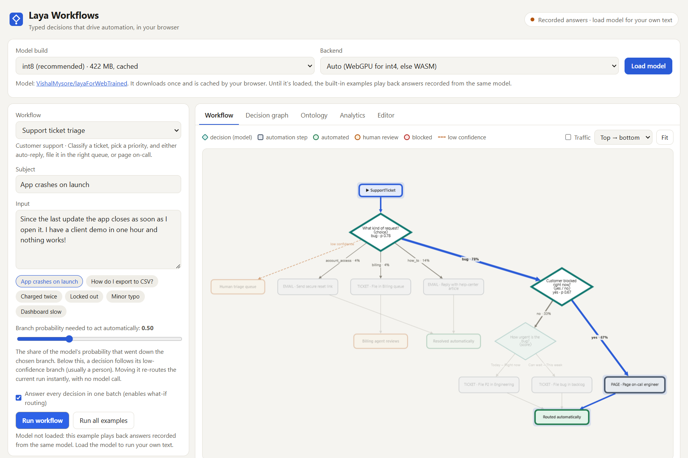

---

## The problem with "let the LLM decide"

Most workflow automation that uses AI works like this. A chat model reads a ticket, writes a paragraph, and some glue code tries to parse a decision out of it. That approach has three weaknesses:

- **You can't see the decision.** It's buried in generated text.
- **You don't know how sure the model was.** A confident-sounding sentence tells you nothing.
- **Nobody can audit it later.** There's no structured record of what was asked, what the options were, and why the case went where it went.

Workflows need something different. A support ticket goes to one of four teams. An insurance claim is either injury or not. An agent's action is read-only, a reversible change, a deletion or an external effect. These are **typed decisions**: a fixed set of options, a probability for each, and a rule that turns them into an action.

[Laya](https://huggingface.co/convaiinnovations/laya-typed-decisions) is built for exactly that. It's a ModernBERT-large encoder with a small transformer head (421M parameters) that never generates text. You give it some text and a question with labelled options. In a single forward pass it returns a calibrated probability for every option. It answers three kinds of question:

| Type | Example | Returns |
|---|---|---|
| `choice` | "Which team should handle this?" → bug / how-to / billing / account | a probability per option |
| `score` | "How urgent is this?" → Can wait … Right now | a probability per level, plus an expected score |
| `noul` (yes/no) | "The customer cannot work at all right now" | p(true) |

The companion project [layaForWeb](https://github.com/vishalmysore/layaForWeb) converted the `laya-typed-decisions` checkpoint to ONNX and quantized it to int8 (422 MB) and int4 (278 MB) so it runs in ONNX Runtime Web. **layaForWorkflows** is what you build on top of it: workflow automation where every decision is a node in a graph.

## A workflow is a graph of typed decisions

Each workflow is a directed acyclic graph with three kinds of node:

- **Decision** (diamond): one typed question to the model. The answer picks the outgoing edge.
- **Task** (box): an automation step such as sending an email, opening a ticket, paging on-call or calling a webhook.
- **Outcome** (terminal): **automated**, **human review**, or **blocked**.

Here is an IT incident flowing through its workflow. The model rated the alert "Major" (85% of its probability went down the "Major – Critical" branch). It decided customers are affected right now (71%) and gave the incident to the application team (42%). Each branch is labelled with the share of probability that went down it, and branches that weren't taken are drawn thinner:

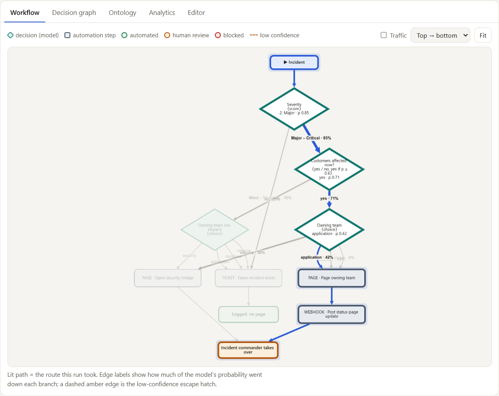

Alongside the diagram, the run is written out as a trace. It lists every question, the full probability distribution, the branch probability that was checked against the threshold, and the automation steps that fired:

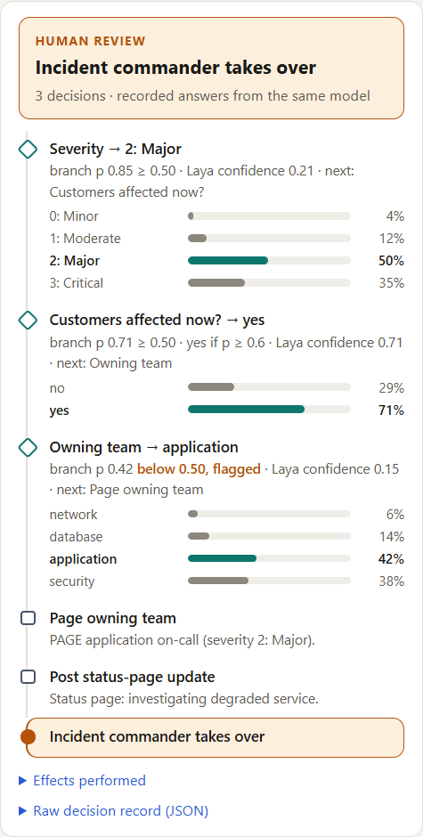

Nothing here is a second model deciding on top of Laya. The routing is plain data (JSON), and the engine that walks it is about 250 lines of dependency-free JavaScript.

## Knowing when *not* to automate

The most important edge in each workflow is the dashed amber one: the **low-confidence escape hatch**. Every decision node can name an `onLowConfidence` target, usually a person. If the model didn't put enough probability on the branch it picked, the case goes there instead.

Here's the AI-agent guardrail looking at *"Agent plan: force-push the rewritten history to the main branch."* The model's top guess was "reversible change", but with only 47% probability. The rest was spread across data deletion (21%) and external effect (22%). That falls below the 0.50 threshold, so instead of auto-approving a force-push, the workflow holds it for a human:

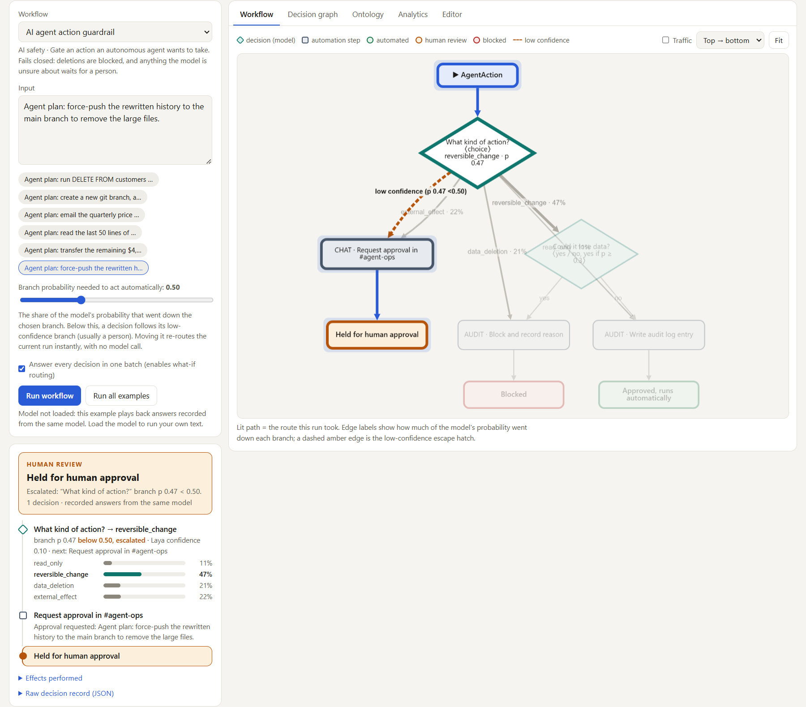

That's the behaviour you want from an automated gate. When the model is unsure, it says so in numbers, and the workflow fails safe.

### Gating on branch probability, not entropy

Laya reports its own `confidence`, defined as 1 minus the normalized entropy of the distribution. On a four-option question that number reads low even when the answer is clearly right. For example, a correct "bug" classification at 78% probability has an entropy confidence of only 0.48. A single threshold on that value would send almost everything to a person.

So the engine gates on the **branch probability** instead: the share of the model's probability that went down the chosen route. For a choice that's the top option's probability. For a score range it's the sum over the levels in that range. For yes/no it's p or 1 − p. Laya's entropy confidence is still recorded and shown in every trace. The slider now means the same thing on every node: *act on your own only if at least X of the probability agrees.*

### Fail-closed yes/no gates

This checkpoint's yes/no probabilities are compressed toward the middle by its calibration temperature (about 2.0). "Could this permanently lose data?" gets p = 0.48 for a production `DELETE`, but only 0.13 to 0.16 for safe actions. The classes separate cleanly, just not at 0.5. So yes/no nodes can set a `cutoff`, the p(true) needed to take the "true" branch. The guardrail's data-loss check uses `cutoff: 0.3`, so it is deliberately trigger-happy, because a false alarm costs far less than a lost table.

## Decisions as graph nodes

The **Decision graph** view takes a single run and expands every decision into *all* of its options, not just the one that was chosen. Each option is a node sized by its probability and labelled with where it would have routed. The highlighted chain is the path the run actually took. Here, a refund request for a mug that arrived shattered: "damaged" (66%) leads to "photo evidence given? yes" (67%), which leads to an automatic refund.

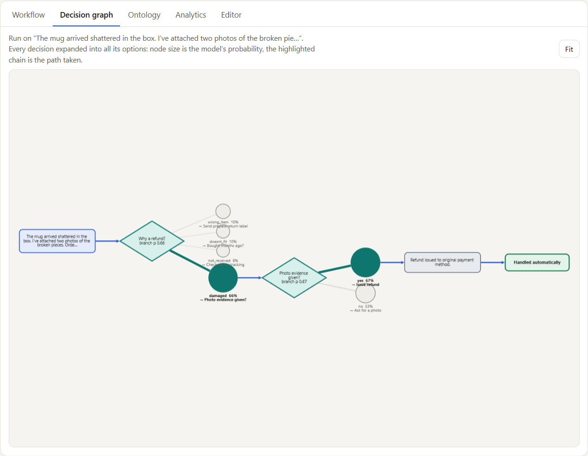

This is the view to show an auditor. It records what the model thought, how strongly, and what would have happened otherwise.

## What-if: move the threshold, re-route instantly

By default the page answers **every** decision node of a workflow in one batched forward pass, including nodes the run never reaches. Because every answer is stored, the threshold slider can re-route a run instantly without calling the model again.

At 0.50 the mug refund is automated:

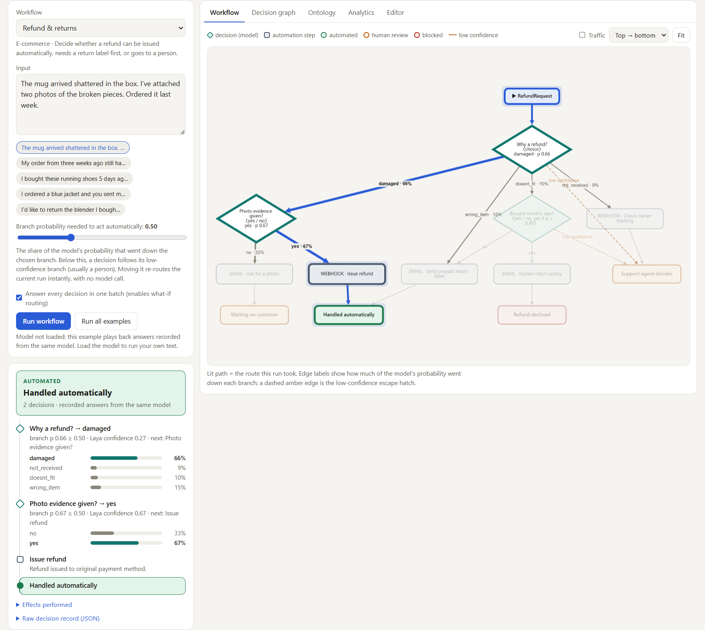

Drag the slider to 0.70 and the same answers re-route. "Damaged" at 66% no longer clears the bar, so the case goes to a support agent, and the result card says so:

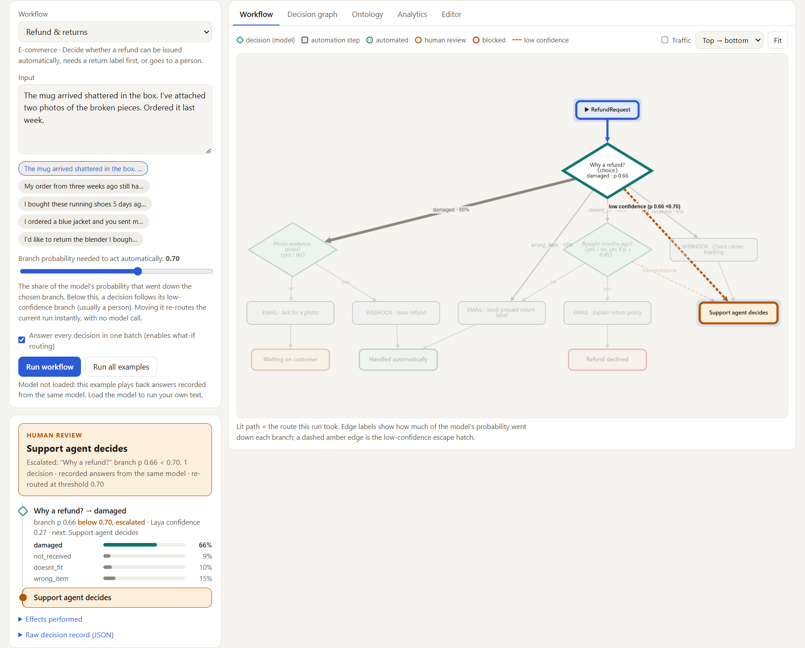

## Traffic: where do cases actually go?

Run a batch and switch on **Traffic**. Edge widths become counts, which shows at a glance how a workflow behaves on real inputs. For the guardrail's examples, 4 of 7 runs were held for approval, 2 were auto-approved and 1 was blocked:

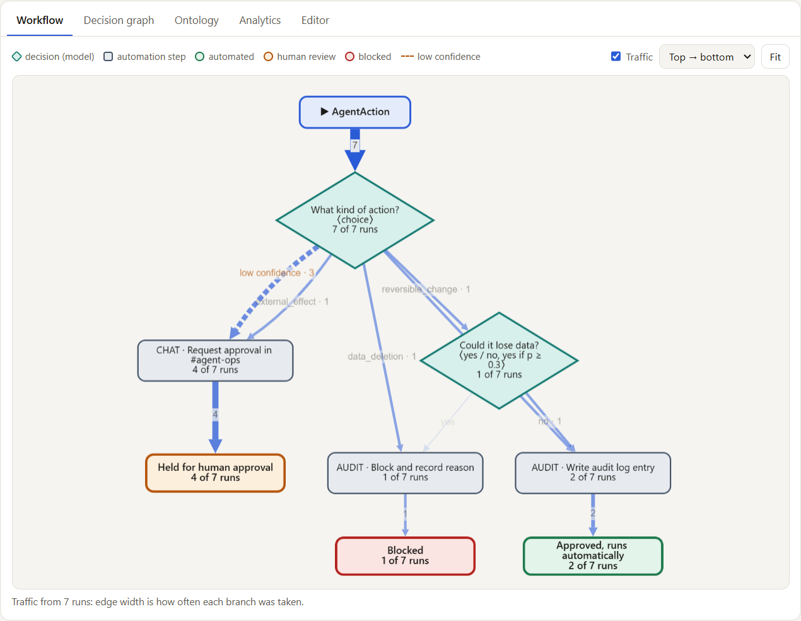

## An ontology of decisions

Decisions deserve to be data, not log lines. The page keeps an OWL/RDFS ontology and fills it as you work.

**Schema (TBox).** The classes are `Workflow`; `DecisionNode`, `TaskNode` and `OutcomeNode` (with subclasses `AutomatedOutcome`, `HumanReviewOutcome` and `BlockedOutcome`); `Question` (`ChoiceQuestion`, `ScoreQuestion`, `YesNoQuestion`); `Option`; `Case` (with one subclass per domain entity: `SupportTicket`, `Claim`, `Invoice` and so on); `Run`; `Decision`; and `Effect`. Object properties link them: `asks`, `hasOption`, `routesTo`, `escalatesTo`, `processes`, `hasDecision`, `atNode`, `selected`, `followedBy`, `performed` and `endedAt`.

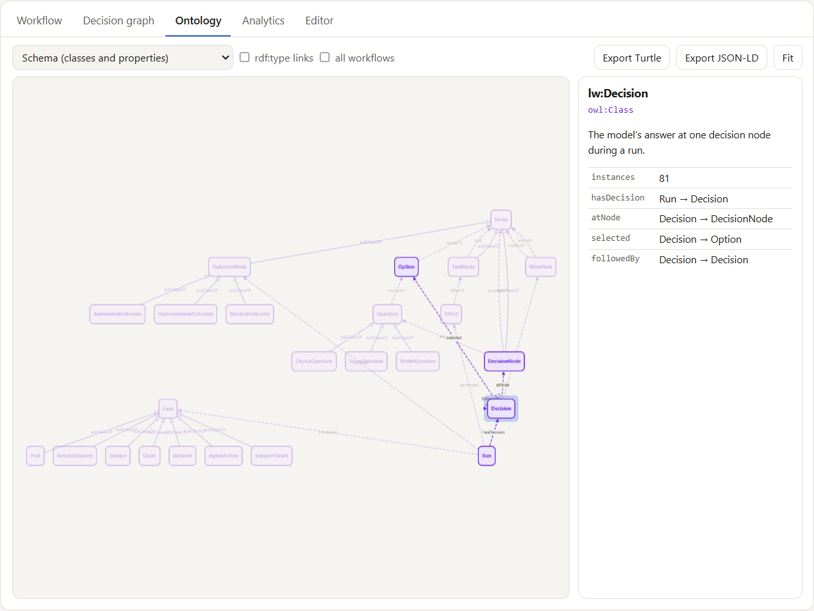

**The workflows as data.** Every workflow node, question and option is an individual. A decision node `asks` a question, the question `hasOption` options, and each option `routesTo` a node:

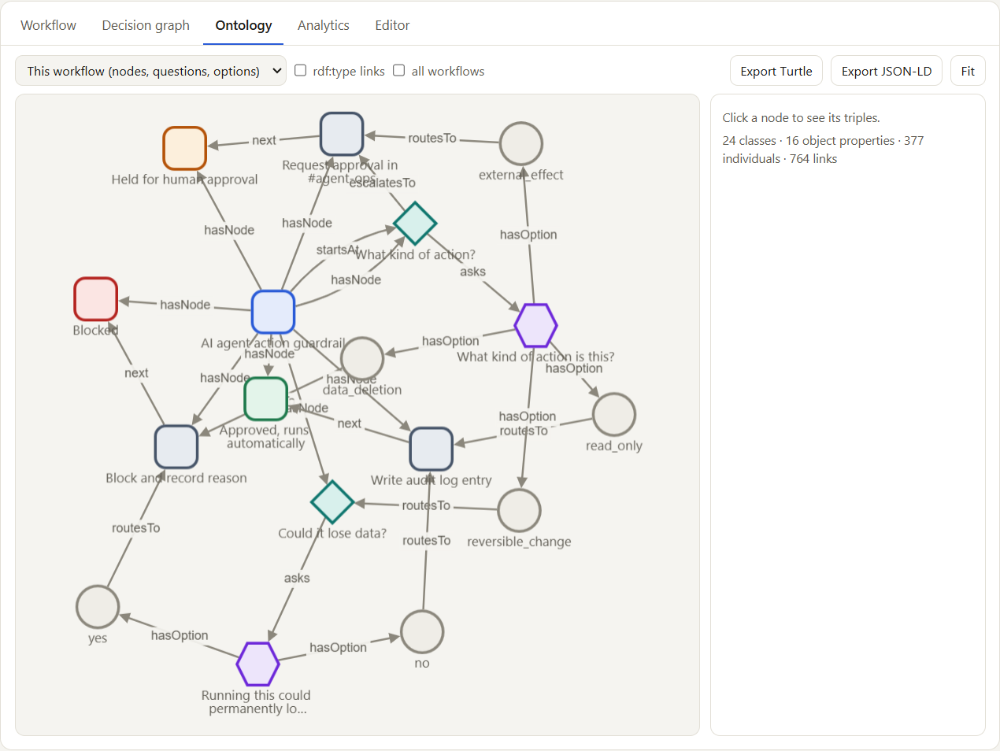

**Runs and decisions (ABox).** Every run becomes a `lw:Run` that `processes` a case. It `hasDecision` a chain of `lw:Decision` individuals, each of which `selected` an `lw:Option` with its confidence, probability and threshold. The run `performed` effects and `endedAt` an outcome. Click any node to see its triples. Here, a guardrail run that was held for approval:

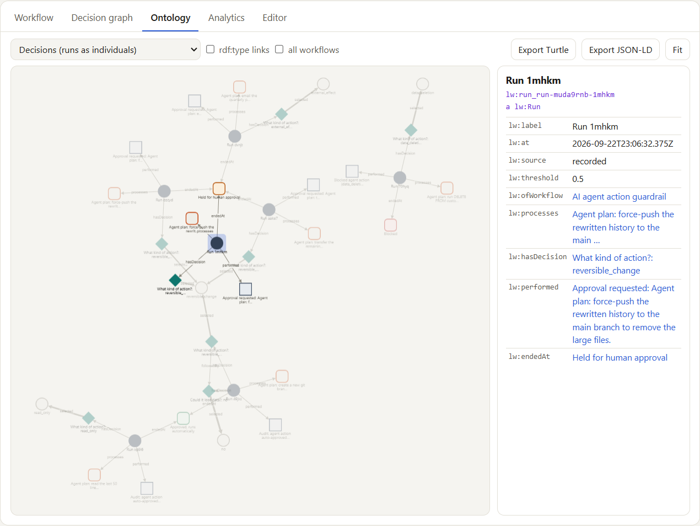

The whole graph exports as **Turtle** or **JSON-LD**, so you can load it into a triple store and query your decision history with SPARQL. For example: *"which options were selected with probability below 0.5 last week, and where did those cases end up?"*

## Analytics

The Analytics tab summarises the run history.

- **Outcome mix as the threshold changes** is a stacked area chart computed by re-routing stored answers at every threshold from 0.30 to 0.95. No model calls are needed, and it shows the trade-off between automation and review directly.
- **Branch probability per decision node** is a strip plot with one dot per run and a threshold marker on each row. Faint dots are answers computed in the batch but off the path taken.
- **Outcomes by workflow** shows the automated / human / blocked split for every workflow.

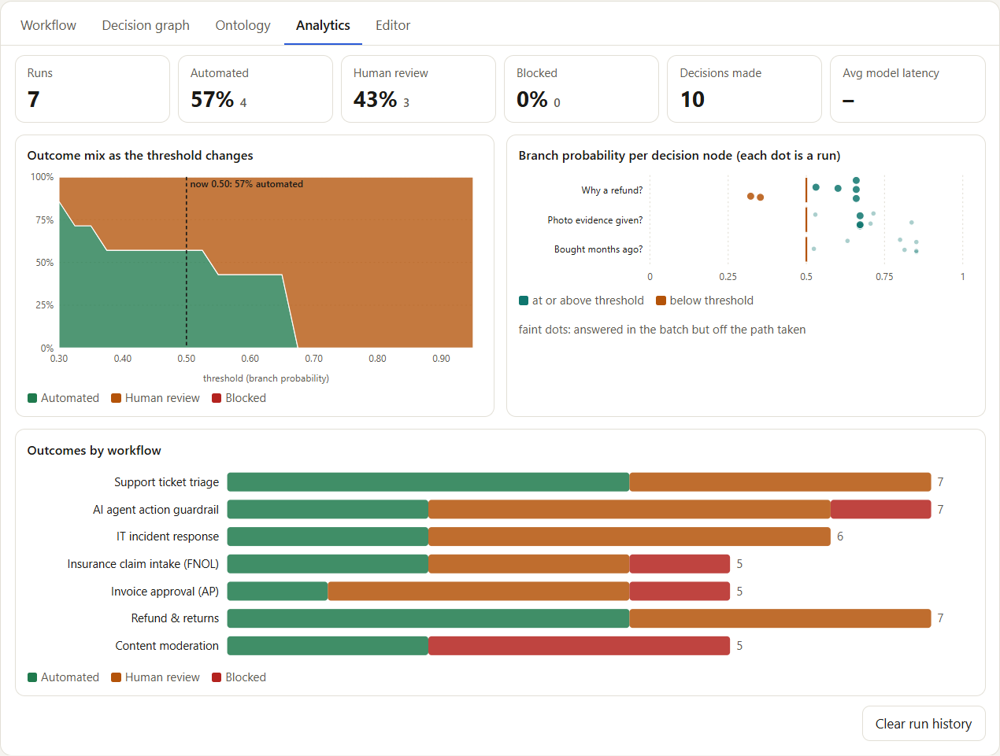

## Workflows are data: the editor

Every workflow can be edited as JSON in the browser. Validation catches:

- routes that point to missing nodes
- options with no route
- malformed score ranges
- cycles and unreachable nodes
- a `cutoff` set on a node that isn't yes/no

Edits are saved in the browser and can be exported, imported or created from a starter template.

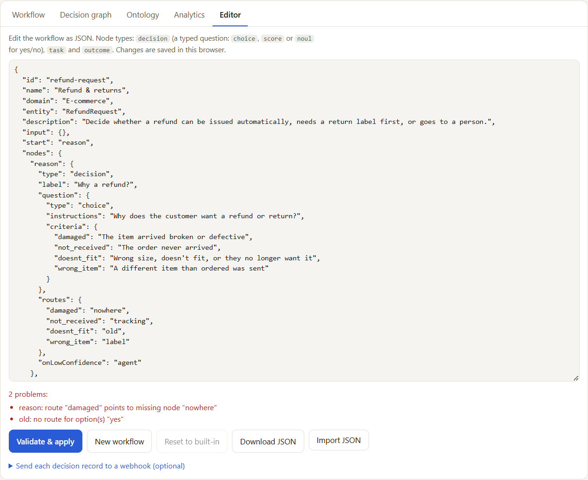

A score route is a level range (`"0-1"`, `"2"`, `"2+"`), so several levels can share a branch. Task templates such as `"PAGE {{answers.owner.selected}} on-call"` can use any answer. An optional webhook receives the full decision record after each run.

## Running the real model in the tab

Click **Load model** and the page streams the int8 build from Hugging Face. That's a small ONNX graph plus 18 weight parts of 24 MiB each, cached in the browser's Cache Storage. On the machine used for these screenshots:

- the first download took about 39 s
- a repeat visit took 1.9 s, with all 18 parts from cache (shown below)
- creating the ONNX Runtime session took about 2 s
- a full workflow run took under a second on WASM with 4 threads

Here is a refund message that isn't one of the built-in examples, run live:

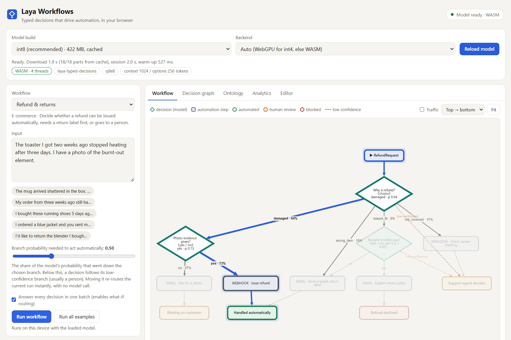

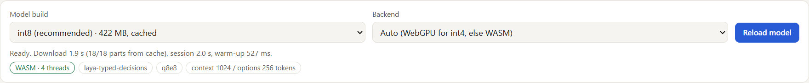

Before the model is downloaded, the built-in examples play back `recorded.json`: the answers the same model gave for exactly those messages, labelled as recorded in the UI. Every recorded answer is keyed to a fingerprint of its question, so an edited workflow always uses the live model. A unit test fails in CI if the examples or questions change without re-recording.

## Tuning questions against the model, not against intuition

I checked every question in the built-in workflows against the model's real outputs, and several first drafts didn't survive:

- **Dollar amounts don't work.** Asked to bucket invoice totals, the model put a $312 box of printer paper and a $186,000 hosting contract in the same "$10,000 to $50,000" bucket. "What is this invoice for?" (supplies, equipment, services, annual contract) got all four right, so invoices now route by what was bought.
- **Categories beat abstract risk.** "How risky is this action?" was vague. "What kind of action is this?" (read-only, reversible change, data deletion, external effect) put 69% on data deletion for the `DELETE` and 71% on read-only for reading a log file. It was unsure, at 43% and 47%, on exactly the two cases it misread: a money transfer and a force-push. That uncertainty is precisely what the escalation edge is for.
- **Concrete statements beat vague ones.** "The customer cannot work at all right now because of this problem" separates a crashed app on demo day (0.67) from a typo report (0.18) far better than an urgency score does.

At the default threshold, the 37 built-in examples end up **14 automated, 17 with a person and 6 blocked**, and the escalations land on the ambiguous or misread cases rather than the clear ones.

## It works on a phone, and in the dark

The layout collapses to one column, and every graph, chart and colour follows the system light or dark theme:

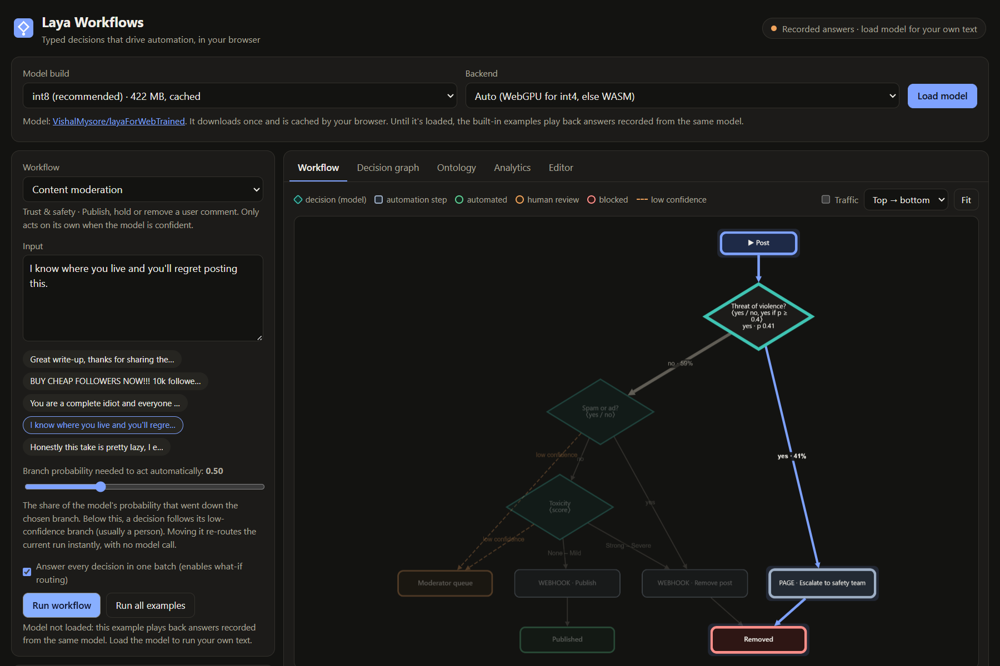
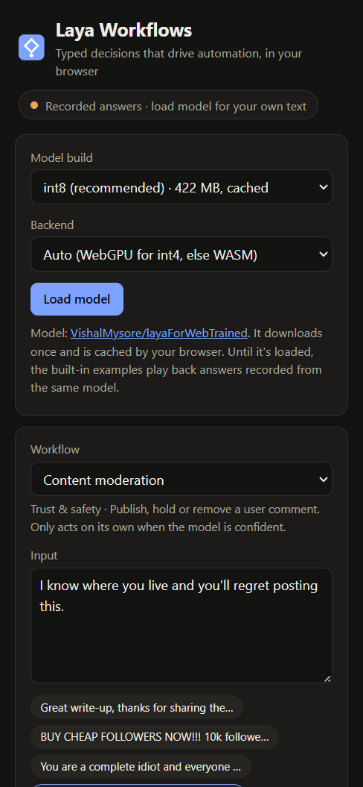

## How it's built

| Piece | What it does |
|---|---|
| `web/engine.js` | Validation (missing routes, cycles, orphans), execution, branch-probability gating, what-if replay. No DOM, unit-tested in Node. |
| `web/workflows.js` | The seven built-in workflows as plain data |
| `web/ontology.js` | TBox and ABox builder, Turtle and JSON-LD serialisers |
| `web/graphs.js` | Cytoscape.js with the dagre layout: workflow diagram, decision graph, ontology |
| `web/charts.js` | Hand-rolled SVG charts that follow the theme |
| `web/model.js` | Streams, caches and starts the ONNX model; queues calls, because an ONNX Runtime session runs one inference at a time |
| `web/laya-core.js` | The Laya inference port from layaForWeb (token sequence builder, calibrated softmax) |

Deployment is a GitHub Actions workflow. It runs the unit tests, assembles a static site of about 30 MB (the page plus ONNX Runtime Web, Tokenizers.js and Cytoscape), and publishes it to GitHub Pages. GitHub Pages can't send the COOP/COEP headers that multithreaded WebAssembly needs, so a small service worker scoped to the project folder adds them.

## Case study: layaForRepairsTriage & Awaab's Law

In English social housing, Awaab's Law (Section 42 of the Social Housing (Regulation) Act 2023) sets strict statutory timescales for landlords to investigate and make safe hazardous conditions such as damp, mould, and emergency repairs.

**layaForRepairsTriage** adapts this workflow automation architecture into a safety-first repairs triage application:

1. **Model Only Classifies or Escalates**: The in-browser model only classifies repair categories, estimates severity, and flags vulnerability cues. It is mathematically and architecturally barred from ever closing a case or dismissing a report.
2. **Three Sequential Safety Gates**: The only automated outcome allowed is `routine_outcome`, and only after passing `emergency_danger = false`, `essential_service = false`, and `hidden_hazard = false`.
3. **Deterministic Statutory Clock**: Code, not the model, calculates working days, skips bank holidays, accounts for daylight saving transitions, checks phase applicability, and computes deadline statuses (Met, On Track, Due Soon, Breached).
4. **Append-Only Audit Ledger**: Every action (triage, inspection, contact attempt, make-safe, override, case closure) is recorded as an immutable event and exported as a JSON-LD compliance audit pack.
5. **Interactive Demo Clock**: Housing officers can simulate future dates via a live slider to observe how statutory deadlines progress and trigger alternative accommodation alerts when make-safe timescales are at risk of breach.

## Try it

1. Run locally with `python serve.py 8000` or open the live deployment.
2. Explore built-in synthetic cases on the **Cases & Clock** tab.
3. Slide the **Demo Clock** to simulate time passage and inspect statutory countdown chips.
4. Open any case to inspect the audit ledger, record inspections, and draft plain-English tenant letters.
5. Switch to **Workflow** to see the DAG and lit triage paths.

---

*Built on [Laya](https://huggingface.co/convaiinnovations/laya-typed-decisions) by ConvAI Innovations (Apache-2.0), itself built on ModernBERT-large by Answer.AI and LightOn. This is an unofficial project and is not affiliated with ConvAI Innovations. All example messages are synthetic. Screenshots were captured with `scripts/capture_screenshots.py`.*
